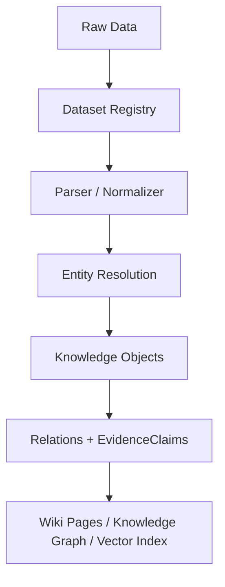

# PlantGeneWiki Data Layout

PlantGeneWiki separates project assets from large raw data. The Git repository should contain code, configuration, documentation, metadata schemas, tests, and small samples. Large raw genome files, database snapshots, PGCP JSON dumps, vector stores, SQLite databases, and generated bulk outputs should stay outside Git or under ignored data directories.

## Repository Data Areas

```text
data/
??? manifests/    # Dataset registries and lightweight metadata, ignored unless explicitly unignored later
??? samples/      # Small test fixtures and format examples
??? processed/    # Rebuildable intermediate or normalized outputs, ignored
??? raw/          # Local raw inputs, ignored
??? database/     # Local database/index files, ignored
```

The current policy is simple: data/ is ignored as a whole. If a small example or schema must be tracked later, unignore that specific file explicitly instead of loosening the whole data directory.

## External Raw Data Store

Large raw data should remain in external storage, for example:

```text
/path/to/external/genomes/
/path/to/external/PlantGeneWiki/
```

The project should reference those paths through config files or Dataset registry records instead of hard-coding raw paths in scripts.

## Dataset Registry Pattern

Raw files enter PlantGeneWiki through Dataset records:



This means a genome FASTA, GFF annotation, PGCP JSON directory, GWAS table, or literature supplement is first registered as a Dataset. Parsers then convert it into Species, Gene, Orthogroup, Trait, Pathway, Literature, and EvidenceClaim records.

## Raw Data Conversion Rules

| Raw data type | Dataset type | Conversion result |
|---|---|---|
| Genome FASTA | genome_sequence | Updates Species genome version metadata and records the sequence source. |
| GFF/GTF annotation | genome_annotation | Generates Gene objects and extracts coordinates, transcripts, and gene structure. |
| Protein/CDS sequence set | sequence_set | Adds protein IDs, sequence lengths, and analysis inputs to Gene objects. |
| GO/KEGG/InterPro annotation table | functional_annotation | Updates Gene annotations and creates Gene-Pathway / Gene-Function relations. |
| Orthology result | orthology_result | Generates Orthogroup objects and creates Gene-Orthogroup relations. |
| Expression matrix | expression_profile | Generates expression evidence and creates Gene-condition/tissue relations. |
| QTL/GWAS table | trait_association | Generates Trait, locus, and Gene-Trait EvidenceClaim records. |
| PGCP JSON | external_database_record | Updates Gene, Orthogroup, orthology relations, and external evidence records. |
| Literature PDF/abstract | literature_text | Generates Literature objects and EvidenceClaim records. |

## Current Policy

- Do not move large external genome directories into the repository.
- Do not commit large files under data/.
- Keep external paths in local Dataset registry metadata, and use placeholders in public examples.
- Keep apps/agent local runtime state unchanged unless explicitly cleaning it.
- Treat PGCP, IMP, NCBI, BRAD, and literature as sources or batches, not as the long-term structure of normalized knowledge.
