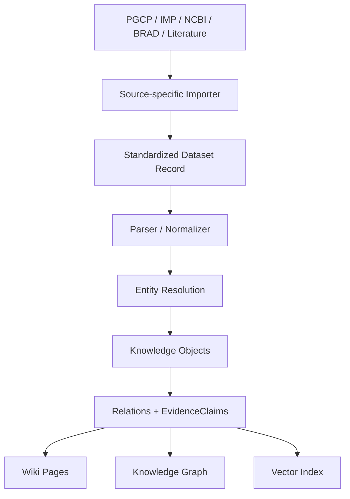

# Standardized Data Model

This document defines how PlantGeneWiki should move from source-specific batches to source-independent knowledge processing.

## Core Principle

PGCP, IMP, NCBI, BRAD, Ensembl Plants, literature collections, and local analysis results are data sources, not long-term boundaries for the knowledge base.

Source and batch information should be stored as metadata inside Dataset, Provenance, and EvidenceClaim records. After parsing and normalization, downstream processing should operate on standardized objects, relationships, and evidence records instead of source-named folders.

## Processing Flow



## Source, Dataset, Batch, Provenance

| Concept | Meaning | Example |
|---|---|---|
| Source | The external or internal origin of data | PGCP, NCBI, IMP, BRAD, PubMed |
| Dataset | A registered data unit that can be parsed or rebuilt | PGCP Arabidopsis gene JSON snapshot |
| Batch | A specific acquisition or processing run | pgcp_202606_atha_gene_json |
| Provenance | The trace showing where a normalized object, relation, or claim came from | source URL, API endpoint, file checksum, parser version |
| EvidenceClaim | A structured statement supported by one or more sources | Gene X is associated with Trait Y in PMID:xxxx |

## Dataset Record Fields

Each Dataset record should include at least:

| Field | Description |
|---|---|
| dataset_id | Stable identifier of the registered dataset |
| dataset_type | Data type, such as genome_annotation, orthology_result, literature_text |
| source | Data source name, such as PGCP or NCBI |
| batch_id | Acquisition or processing batch identifier |
| species | Related species, if applicable |
| version | Source version, annotation version, or snapshot date |
| location | Local path, external storage path, URL, or API endpoint |
| checksum | File or directory checksum when feasible |
| parser | Parser or importer used to convert this dataset |
| parser_version | Parser version or Git commit |
| status | registered, parsed, normalized, failed, deprecated |
| created_at | Registration time |
| updated_at | Last update time |

## Normalized Output Boundary

Source-specific importers may live under scripts/importers/ or src/plantgenewiki/importers/. Their output should be source-independent records, for example:

- Species records
- Gene records
- Orthogroup records
- Trait records
- Literature records
- Dataset records
- Relation records
- EvidenceClaim records

After this boundary, build scripts should consume the standardized records only. They should not need to know whether a gene annotation came from PGCP, IMP, NCBI, BRAD, or a literature-derived table.

## Directory Policy

Source names are acceptable for raw acquisition and importer code:

```text
scripts/importers/pgcp/
archive/imp/importer/imp/  # archived, not active
scripts/importers/ncbi/
src/plantgenewiki/importers/pgcp/
```

Source names should not define the long-term structure of normalized data. Prefer type-oriented and registry-driven outputs:

```text
data/processed/objects/
data/processed/relations/
data/processed/evidence/
data/processed/indexes/
```

The data directory is ignored by Git. The repository should track schemas, examples, and registry templates, not bulk normalized outputs.

## Current Transition Policy

The active PGCP source-specific scripts live under scripts/importers/pgcp. IMP scripts are archived under archive/imp/ and are not part of the current active workflow. New reusable logic should move toward:

```text
src/plantgenewiki/importers/
src/plantgenewiki/normalize/
src/plantgenewiki/provenance/
```

Do not perform a large script migration until the Dataset and Knowledge Object schemas are stable.
