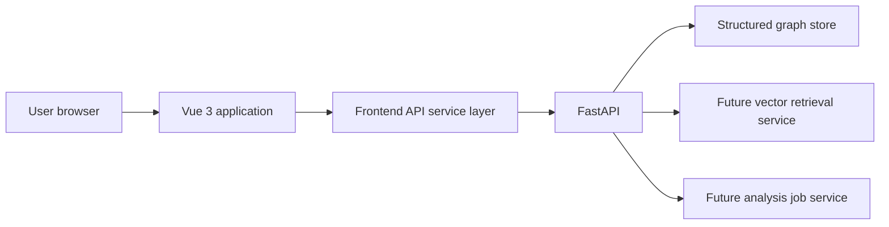

# PhytoAtlas Vue Frontend Redesign

## 1. Goal

Replace the existing Astro prototype with a responsive Vue application and rename the active product from PlantGeneWiki to PhytoAtlas across the current codebase.

The redesign must support a public Wiki reading experience, dynamic API-backed search, interactive knowledge graph exploration, and future analysis services without retaining Astro or a compatibility layer for the previous product name.

## 2. Confirmed decisions

- Product name: `PhytoAtlas`.
- Frontend framework: Vue 3 with Vite and TypeScript.
- Routing: Vue Router.
- Shared client state: Pinia.
- Backend: FastAPI remains an independent service.
- Graph visualization: Cytoscape.js.
- Visual direction: Wiki and data-application hybrid.
- Brand direction: botanical atlas green.
- Homepage: unified search first.
- Knowledge object pages: continuous Wiki pages with anchored section navigation.
- Graph page: graph canvas first.
- Search results: unified list with faceted filters.
- Migration: remove the old brand and Astro architecture in one change series without compatibility aliases.

## 3. System architecture



The Vue application consumes only documented HTTP APIs. It must not import generated JSON through build-time glob patterns and must not read raw or normalized data directories directly.

The first migration connects only to APIs that already exist. Vector retrieval, literature processing, and analysis tools receive stable navigation and service boundaries, but no fabricated data or fake execution behavior.

## 4. Technology stack

### 4.1 Frontend

- Vue 3 Composition API
- Vite
- TypeScript
- Vue Router
- Pinia
- Cytoscape.js
- Vitest
- Vue Test Utils

The application remains in `apps/web` so existing deployment ownership boundaries remain recognizable.

### 4.2 Backend

- FastAPI
- Existing graph store adapter and graph API
- Python package renamed from `plantgenewiki_api` to `phytoatlas_api`

The API must remain independent from the frontend build and deployment.

## 5. Naming migration

The active repository must use the following names:

| Context | New name |
|---|---|
| Product display name | `PhytoAtlas` |
| Frontend package | `phytoatlas-web` |
| Backend Python package | `phytoatlas_api` |
| Shared Python package | `phytoatlas` |
| Backend environment prefix | `PHYTOATLAS_` |
| Frontend API variable | `VITE_API_BASE_URL` |
| API title | `PhytoAtlas API` |

The migration does not preserve old Python imports, environment variable aliases, package names, or display names.

Historical Git commits are not rewritten.

Stable biological identifiers remain unchanged. Existing prefixes such as `gene:`, `species:`, `dataset:`, and `seq:` identify domain objects and must not be replaced with product-branded prefixes.

The GitHub repository and server directory are renamed only after code, tests, documentation, and startup commands work under the new name.

## 6. Visual system

PhytoAtlas uses a botanical atlas green system:

- Deep blue-green for headings and primary text.
- Botanical green for primary actions, active navigation, and status emphasis.
- Pale green-gray page backgrounds.
- White content cards with restrained borders rather than heavy shadows.
- Compact scientific typography and stable spacing.
- No decorative gradients that reduce data readability.

The header wordmark uses `PhytoAtlas` and a short supporting label such as `Plant knowledge intelligence`. A future custom mark may replace the text wordmark without changing header layout.

## 7. Routes and pages

| Route | Responsibility |
|---|---|
| `/` | Unified-search-first homepage |
| `/search` | Unified result list with faceted filters |
| `/genes/:id` | Continuous Wiki gene page |
| `/species/:id` | Continuous Wiki species page |
| `/graph` | Canvas-first knowledge graph explorer |
| `/datasets/:id` | Dataset and provenance page |
| `/sequence-records/:id` | Sequence record page |
| `/literature` | Honest literature module planning state |
| `/tools` | Honest analysis tool planning state |
| `/:pathMatch(.*)*` | Not-found page |

The homepage does not show a second search field in the top-right header. Internal routes show a compact header search field.

## 8. Component boundaries

### 8.1 Application shell

- `AppHeader`: brand, primary navigation, and conditional internal-page search.
- `AppFooter`: project identity, documentation, version, and status links.
- `AppLayout`: shared page shell and route outlet.

### 8.2 Search

- `GlobalSearch`: query entry and route navigation.
- `SearchFilters`: object type, species, and evidence facets supported by the API.
- `SearchResultCard`: stable presentation of heterogeneous knowledge objects.

### 8.3 Knowledge objects

- `ObjectPageLayout`: breadcrumb, object identity, left anchored navigation, and content column.
- `ObjectSectionNav`: scroll-aware active section and anchor navigation.
- `KnowledgeSection`: permanent titled content section.
- `EvidencePanel`: dataset, version, provenance, confidence, and review status.
- `NotAvailable`: consistent empty permanent-field rendering.

Knowledge pages retain permanent sections even when values are unavailable. Missing values render as `Not available`; they do not remove sections or change page structure.

### 8.4 Knowledge graph

- `GraphToolbar`: center object, species, and relation controls.
- `GraphCanvas`: Cytoscape.js lifecycle and graph interactions.
- `NodeInspector`: selected node identity, properties, and Wiki link.
- `GraphLegend`: object type encoding.

The first graph version uses the existing search and neighbor APIs. It does not claim arbitrary-depth reasoning or advanced graph analytics.

### 8.5 Shared states

- `LoadingState`
- `EmptyState`
- `ErrorState`
- `PlanningState`

API failures do not fall back to bundled sample JSON.

## 9. Data flow

Frontend requests are centralized under `src/services`.

```text
View
  -> Pinia store or route loader
  -> typed API service
  -> FastAPI endpoint
  -> structured response
  -> explicit loading, empty, success, or error state
```

Global Pinia state is limited to shared search context, selected species, and durable interface preferences. Page-specific response data remains local to the page or a focused composable.

## 10. Error handling

- API unavailable: show the failed service and retry action.
- Empty search: keep the user on the current page without navigation.
- No results: show a distinct empty state with retained filters.
